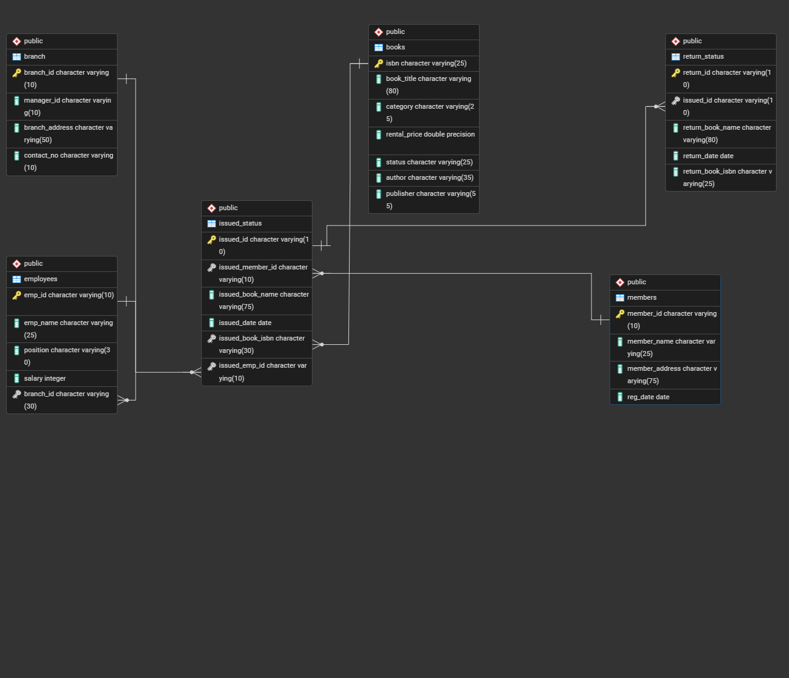

# Library Managment System SQL Project

## Project Overview

**Project Title**: Library Managment System
**Database**: `library_db`

In this project, I implemented a Library Management System using SQL.
I designed the database structure, created and managed tables, performed CRUD operations, and wrote SQL queries to retrieve and manage data efficiently.
This project highlights my understanding of database design, SQL operations, and query execution.

## Objective

1. **Library Management System database**: Creating and populating tables for branches, employees, members, books, issued status, and return status.
2. **CRUD Operations**: Performed Create, Read, Update, and Delete operations on the database data.
3. **SQL Queries**: Developed queries to analyze and retrieve specific data from the database.

## Project Structure

### Database Setup


- **Database Creation**: Created the `library_db` database.
- **Table Creation**: Created tables for branches, employees, members, books, issued status, and return status.

```sql
CREATE DATABASE library_db;

DROP TABLE IF EXISTS branch;
CREATE TABLE branch
(
            branch_id VARCHAR(10) PRIMARY KEY,
            manager_id VARCHAR(10),
            branch_address VARCHAR(30),
            contact_no VARCHAR(15)
);


-- Create table "Employee"
DROP TABLE IF EXISTS employees;
CREATE TABLE employees
(
            emp_id VARCHAR(10) PRIMARY KEY,
            emp_name VARCHAR(30),
            position VARCHAR(30),
            salary DECIMAL(10,2),
            branch_id VARCHAR(10),
            FOREIGN KEY (branch_id) REFERENCES  branch(branch_id)
);


-- Create table "Members"
DROP TABLE IF EXISTS members;
CREATE TABLE members
(
            member_id VARCHAR(10) PRIMARY KEY,
            member_name VARCHAR(30),
            member_address VARCHAR(30),
            reg_date DATE
);


-- Create table "Books"
DROP TABLE IF EXISTS books;
CREATE TABLE books
(
            isbn VARCHAR(50) PRIMARY KEY,
            book_title VARCHAR(80),
            category VARCHAR(30),
            rental_price DECIMAL(10,2),
            status VARCHAR(10),
            author VARCHAR(30),
            publisher VARCHAR(30)
);


-- Create table "IssueStatus"
DROP TABLE IF EXISTS issued_status;
CREATE TABLE issued_status
(
            issued_id VARCHAR(10) PRIMARY KEY,
            issued_member_id VARCHAR(30),
            issued_book_name VARCHAR(80),
            issued_date DATE,
            issued_book_isbn VARCHAR(50),
            issued_emp_id VARCHAR(10),
            FOREIGN KEY (issued_member_id) REFERENCES members(member_id),
            FOREIGN KEY (issued_emp_id) REFERENCES employees(emp_id),
            FOREIGN KEY (issued_book_isbn) REFERENCES books(isbn) 
);


-- Create table "ReturnStatus"
DROP TABLE IF EXISTS return_status;
CREATE TABLE return_status
(
            return_id VARCHAR(10) PRIMARY KEY,
            issued_id VARCHAR(30),
            return_book_name VARCHAR(80),
            return_date DATE,
            return_book_isbn VARCHAR(50),
            FOREIGN KEY (return_book_isbn) REFERENCES books(isbn)
);

```

## Conclusion

Through this project, I practiced using SQL to create and manage a Library Management System. It includes database setup, data manipulation, and querying, which helped me strengthen my understanding of SQL and data management.
